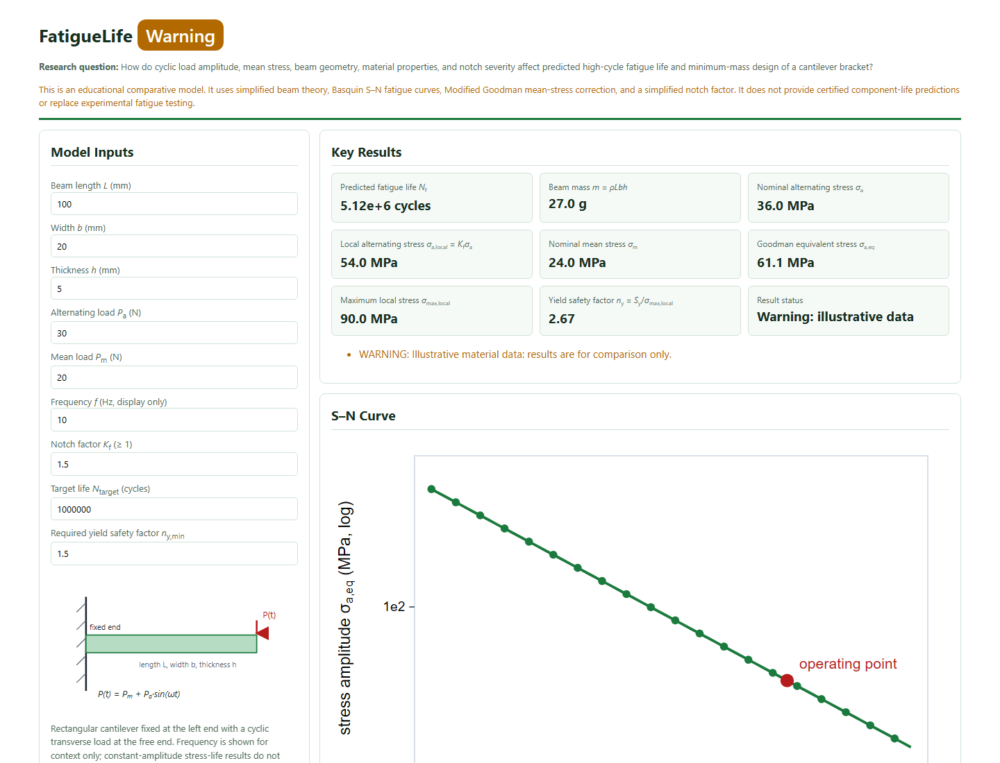
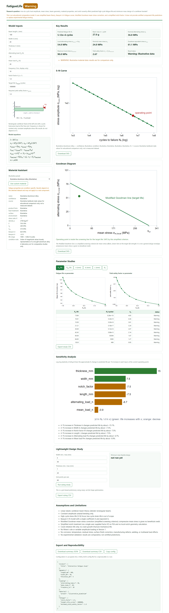

# FatigueLife

FatigueLife is a small, local Python tool for asking a practical engineering
question: how do load, dimensions, material choice, and a stress concentration
change the estimated life of a cantilever bracket?

> **Scope warning.** This is an educational comparative model. It uses
> simplified beam theory, Basquin S–N fatigue curves, Modified Goodman
> mean-stress correction, and a simplified notch factor. It does not provide
> certified component-life predictions or replace experimental fatigue testing.

## What it does

- Models a rectangular cantilever beam fixed at one end with a cyclic end load
  `P(t) = Pm + Pa·sin(ωt)` and computes bending stresses, predicted fatigue
  life, beam mass, and a yield safety factor.
- Labels each result as valid, a warning, or invalid, with assumptions and
  warnings attached to the result.
- Runs parameter sweeps (load, mean load, thickness, width, length, notch
  factor), ranked sensitivity analysis, and a grid-based minimum-mass sizing
  study.
- Serves a zero-dependency local dashboard (stdlib HTTP server, vanilla
  JavaScript, SVG charts) with an S–N curve, a Goodman diagram, and full
  material provenance on screen.
- Exports summaries and studies as CSV/JSON, with material source and
  confidence embedded in every export, and reproduces any run from a YAML or
  JSON config file.

## Main equations

```
I            = b·h³ / 12                        second moment of area
σ_a          = 6·Pa·L / (b·h²)                  nominal alternating bending stress
σ_m          = 6·Pm·L / (b·h²)                  nominal mean bending stress
σ_a,local    = Kf·σ_a ;  σ_m,local = Kf·σ_m     simplified notch scaling
σ_a,eq       = σ_a,local / (1 − σ_m,local/Sut)  Modified Goodman (denominator
                                                capped at 1 for compression)
σ_a,eq       = A·Nf^b   →   Nf = (σ_a,eq/A)^(1/b)   Basquin stress-life
σ_max,local  = Kf·(σ_m + σ_a) ;  n_y = Sy/σ_max,local
mass         = ρ·L·b·h
```

## Dashboard





The dashboard includes a header with status badge, model inputs with a beam diagram,
material assistant (illustrative presets or a strict custom-material form),
key-result cards · S–N curve · Goodman diagram · parameter studies · ranked
sensitivity chart · lightweight design study · assumptions and limitations ·
export and reproducibility (CSV/JSON/SVG downloads and a copy-config button).

## Quick start

```bash
uv sync --all-extras                                # or: pip install -e '.[yaml]'
./fatiguelife serve configs/baseline.yaml           # local dashboard
./fatiguelife run configs/baseline.yaml --outdir out/
./fatiguelife sweep configs/baseline.yaml --outdir out/
./fatiguelife sensitivity configs/baseline.yaml
./fatiguelife optimize configs/optimization.yaml --outdir out/
./fatiguelife info configs/baseline.yaml
./fatiguelife test
```

Python ≥ 3.10. The only required runtime dependency is numpy; PyYAML is an
optional extra for YAML configs (JSON configs work without it).

## Sample configuration

```yaml
project:
  title: "Illustrative aluminium cantilever fatigue study"
geometry:
  length_mm: 100
  width_mm: 20
  thickness_mm: 5
loading:
  alternating_load_n: 30
  mean_load_n: 20
  frequency_hz: 10
material:
  preset: illustrative_aluminium
fatigue:
  notch_factor: 1.5
  target_life_cycles: 1000000
  minimum_yield_safety_factor: 1.5
study:
  sweep_points: 9
  sweep_span_factor: 4
optimization:
  width_min_mm: 5
  width_max_mm: 50
  thickness_min_mm: 1
  thickness_max_mm: 20
  grid_points: 60
```

Configuration is strict: unknown keys are errors, and invalid keys are never
silently replaced with defaults.

## Material data policy

Fatigue properties are condition-specific. Results depend on the selected
dataset and may not apply to a real component.

- **Illustrative presets** (aluminium alloy, mild steel, stainless steel) are
  clearly labelled `illustrative` and exist for comparative studies only.
- **Custom datasets** must carry the exact grade/alloy, product form, heat
  treatment, surface condition, environment, stress ratio R, density, E, Sy,
  Sut, Basquin A and b (or S–N points to fit), the applicable life range, a
  source citation, and a confidence label. Vague names such as "steel" or
  "aluminium" are rejected.
- The tool never scrapes the internet for material data and never silently
  substitutes a similar material. Every export carries the material's source
  and confidence label. See `configs/materials/custom_material_template.yaml`.

## Assumptions and limitations

- Linear-elastic cantilever-beam theory; constant-amplitude uniaxial bending.
- High-cycle stress-life focus with the Basquin model and Modified Goodman
  correction (a simplified screening criterion; compressive mean stress gets
  no beneficial credit).
- Simplified notch factor Kf — no FEA or local notch-geometry calculation.
- Crack-initiation life only: no crack-growth life, no Miner's rule or
  variable-amplitude loading in Version 1.
- No corrosion, temperature, residual stress, surface-finish correction,
  manufacturing defects, welding, or multiaxial load effects.
- No experimental validation: results are comparative, not certified
  predictions.

## Testing / code verification

`./fatiguelife test` runs the pytest suite: code verification through
analytical relationships, unit tests, and expected physical trends —
`I = b·h³/12`, hand-calculated stresses, proportionality checks (doubling
loads/dimensions), monotonic life trends versus load, thickness, and notch
factor, Goodman-invalid and yield-risk triggers, S–N log-log slope equal to
the Basquin exponent, optimizer feasibility, strict-config errors,
vague-material rejection, export provenance, and a live dashboard smoke test.
This is **not** experimental validation.

## Project structure

```
fatiguelife            executable launcher
src/fatiguelife/       physics core (units, geometry, loading, stress, notch,
                       goodman, basquin, simulate), materials, config, sweep,
                       sensitivity, design, io_data, cli, dashboard(.py/.html)
tests/                 pytest suite (analytical + trend + API tests)
configs/               example studies; configs/materials/ has datasets and a
                       custom-material template
assets/                dashboard screenshot placeholder
```

## Describing this project in an application

“Developed a Python-based computational tool to study how cyclic loads,
component geometry, material properties, and stress concentrations influence
predicted high-cycle fatigue life in cantilever brackets. Implemented beam
theory, Basquin S–N modelling, Modified Goodman mean-stress correction,
parameter sweeps, sensitivity analysis, and preliminary lightweight sizing.”
